  
# 👋 ¡Hola!  Soy Aragorn7372

### 🎓 Estudiante en IES Luis Vives

---

## 🚀 Sobre mí

Soy un estudiante de desarrollo de aplicaciones web en el **IES Luis Vives**, apasionado por crear soluciones tecnológicas y aprender constantemente.  Me encanta explorar diferentes tecnologías y lenguajes de programación.

---

## 💻 Tecnologías y Herramientas

### Frontend

### Backend

### Base de Datos

### Herramientas de Desarrollo

### DevOps & Testing

---

## 📊 Estadísticas de GitHub

  
  
  
  
  
  
  

  

---

## 🌱 Actualmente aprendiendo

- 📱 Desarrollo de backend con Kotlin, Java, C# y Spring Boot.
- 🎨 Desarrollo frontend con Angular y TypeScript.
- 🗄️ Gestión avanzada de bases de datos con PostgreSQL y MongoDB. 
- 🐳 Contenedorización con Docker y Docker Compose. 
- 🧪 Testing automatizado con JUnit, NUnit y Playwright.

---

## 📫 Contacto

💡 *"El código es poesía, y cada proyecto es una nueva historia"*

---

  
  

